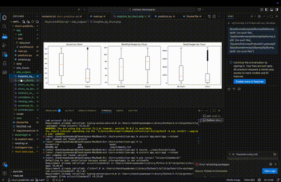
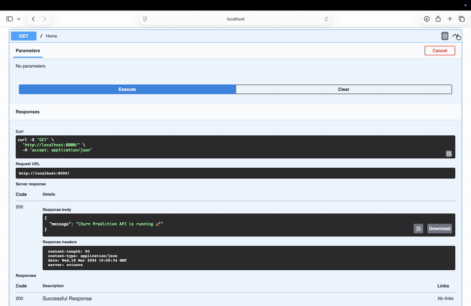

# 🚀 Customer Churn Prediction API

<p align="center">
  
  
  
  
</p>

---

## 📌 Overview

This project is an **end-to-end Machine Learning system** that predicts customer churn for a telecom company.

It combines:

- 📊 Exploratory Data Analysis (EDA)
- 🤖 Machine Learning model
- ⚡ FastAPI-based real-time prediction service
- 🐳 Dockerized deployment

The API predicts whether a customer will churn and provides **probability scores** for decision-making.

---

## ✨ Key Features

- 🔍 Automated EDA with visual outputs (heatmaps, distributions)
- 🤖 ML model trained on real Telco dataset
- ⚡ Real-time prediction via REST API
- 📈 Swagger UI for easy testing
- 🐳 Docker support for production deployment
- 📂 Modular and scalable project structure

---

## 🏗️ System Architecture
Client → FastAPI → Predictor → ML Model → Response
↓
EDA Engine → Charts + Insights

<p align="center">
  
</p>
---

## 📁 Project Structure
churn-prediction-api/
│
├── app/
│ ├── main.py # FastAPI entry point
│ ├── predictor.py # Prediction logic
│ ├── schema.py # Request schema
│ ├── eda/
│ │ └── eda_analysis.py # EDA pipeline
│ └── test/
│
├── data/ # Dataset
├── model/ # Trained models
├── eda_outputs/ # Generated charts
├── eda_inputs/ # Uploaded files
│
├── Dockerfile
├── requirements.txt
└── README.md


---

## 📊 EDA Capabilities

The project includes a **fully automated EDA engine** that generates:

- 📌 Correlation heatmap  
- 📌 Feature distributions  
- 📌 Churn vs feature relationships  
- 📌 Summary statistics  

### 👉 View EDA Dashboard


<p align="center">
  
</p>


---

## ⚙️ Running Locally

## 🎬 Demo


<p align="center">
  
</p>
---

### 1️⃣ Create Virtual Environment

```bash
python3 -m venv venv
source venv/bin/activate
```

### 2️⃣ Install Dependencies
``` bash

pip install -r requirements.txt
```
### 3️⃣ Start Server
```bash
uvicorn app.main:app --reload
```

### 🐳 Running with Docker
```bash
Build Image

docker build -t churn-api .

Run Container

docker run -p 8000:8000 churn-api

```

### 👉 Access API:

http://localhost:8000/docs

### 🔌 API Endpoints
```bash
Endpoint	Method	Description
/	GET	Health check
/predict	POST	Predict churn
/eda/run	POST	Run EDA on dataset
/eda/upload	POST	Upload CSV and run EDA
/eda/summary	GET	Get EDA summary
/eda/gallery	GET	View EDA visual dashboard


{
  "gender": "Female",
  "SeniorCitizen": 0,
  "Partner": "Yes",
  "Dependents": "No",
  "tenure": 12,
  "PhoneService": "Yes",
  "MultipleLines": "No",
  "InternetService": "Fiber optic",
  "OnlineSecurity": "No",
  "OnlineBackup": "Yes",
  "DeviceProtection": "No",
  "TechSupport": "No",
  "StreamingTV": "Yes",
  "StreamingMovies": "Yes",
  "Contract": "Month-to-month",
  "PaperlessBilling": "Yes",
  "PaymentMethod": "Electronic check",
  "MonthlyCharges": 85.5,
  "TotalCharges": 1026.0
}
📤 Example Response
{
  "prediction": {
    "churn_prediction": "Yes",
    "churn_probability": 0.74
  }
}
```
### 🧠 ML Pipeline

- Data Cleaning & Preprocessing

- Feature Engineering

- Model Training (Scikit-learn)

- Model Serialization (Joblib)

- Inference via FastAPI

### 🚀 Future Improvements

- 📊 Feature importance visualization

- 📈 Model monitoring & logging

- 📦 Batch prediction API

- 📄 Downloadable EDA reports

- ☁️ Cloud deployment (AWS/GCP)

### 👩‍💻 Author

Chandrayee Kumar
Senior Software Engineer | AI/ML Enthusiast